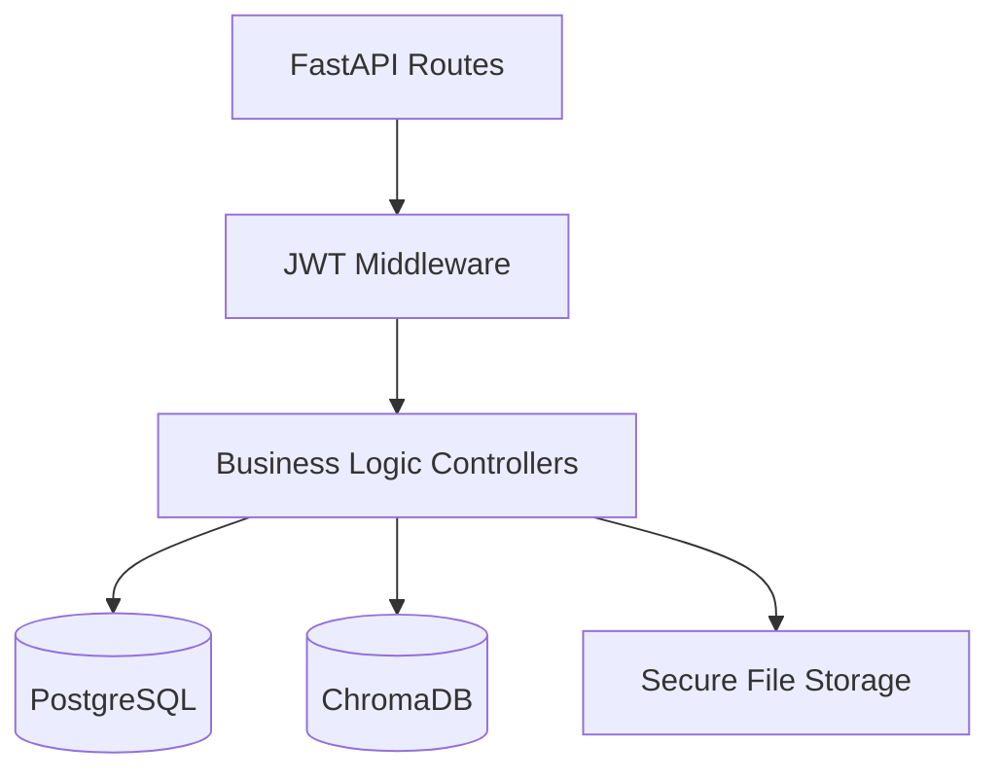

# AI-Powered Resume ATS — Core Platform

> **Version:** 2.0 · **Stack:** FastAPI · PostgreSQL · ChromaDB · sentence-transformers · LangChain

---

## Table of Contents

1. [What Is This Project?](#1-what-is-this-project)
2. [Architecture Overview](#2-architecture-overview)
3. [Global Talent Pool Model](#3-global-talent-pool-model)
4. [Environment Variables & API Keys](#4-environment-variables--api-keys)
5. [API Endpoints](#5-api-endpoints)
6. [How to Run Locally](#6-how-to-run-locally)
7. [End-to-End User Flow](#7-end-to-end-user-flow)
8. [Hybrid Matching Engine](#8-hybrid-matching-engine)

---

## 1. What Is This Project?

**AI-Powered Resume** is a modern **FastAPI** backend service designed to connect **Companies** with **Candidates** via a highly intelligent, AI-driven Applicant Tracking System (ATS).

It features:
- 🔐 **Role-based Authentication:** Secure JWT login for `CUSTOMER` (Candidates) and `COMPANY` accounts.
- 🗄️ **Relational Data:** Uses **PostgreSQL** via SQLAlchemy to handle user profiles, job ownership, and candidate requests.
- 📤 **CV Ingestion:** Candidates upload CVs (PDF/DOCX) which are parsed, chunked, and intelligently analyzed.
- 🧠 **Vector Engine:** Embeds chunked CVs and Job Descriptions (JDs) using local `sentence-transformers` and stores them in **ChromaDB**.
- 🔍 **Hybrid Matching:** Companies match their JDs against the entire global talent pool using a semantic + keyword + experience scoring algorithm.
- 📩 **Two-Way Requests:** Companies can send connection requests to candidates. If accepted, the company can securely download the original CV.

---

## 2. Architecture Overview

This project uses a **Hybrid Database Architecture**:

*   **PostgreSQL (Relational):** The source of truth for Users, Profiles, Authentication, Job Description Ownership, and Candidate Requests.
*   **ChromaDB (Vector/NoSQL):** Handles heavy NLP tasks, storing chunked text, LLM-extracted skills, and dense vectors for ultra-fast semantic searching.



---

## 3. Global Talent Pool Model

Unlike traditional ATS systems where candidates apply to silos, this platform uses a **Global Pool**:
1. **Customers** upload their CVs *once* to their profile.
2. **Companies** create a Job Description.
3. The AI scans the *entire* database of users, ranking every candidate in the system against the company's JD.
4. Companies initiate contact by sending a **Request** to the best-matched candidates.

---

## 4. Environment Variables & API Keys

All configuration lives in **`src/.env`**.

```dotenv
# ── Application ────────────────────────────────────────────────────────────
APP_NAME="ai-power-resume"
APP_VERSION="2.0"

# ── Database ───────────────────────────────────────────────────────────────
DATABASE_URL="sqlite:///./test.db"  # Use postgresql:// for production
VECTOR_DB_PATH="./assets/vectordb"

# ── Authentication ─────────────────────────────────────────────────────────
SECRET_KEY="YOUR_SUPER_SECRET_KEY"
ALGORITHM="HS256"
ACCESS_TOKEN_EXPIRE_MINUTES=10080  # 7 days

# ── LLM & NLP ──────────────────────────────────────────────────────────────
# EMBEDDING_MODEL_NAME="all-MiniLM-L6-v2" # Runs 100% locally
```

---

## 5. API Endpoints

Base URL: `http://localhost:8000`
Interactive Swagger Docs: `http://localhost:8000/docs`

### 🔑 Authentication (`/api/auth`)
- `POST /register`: Create a new user (`CUSTOMER` or `COMPANY`).
- `POST /login`: Retrieve JWT access token.

### 👤 Profiles (`/api/base`)
- `GET /me`: Get logged-in user profile.
- `PUT /customer/profile`: Update candidate profile details.
- `PUT /company/profile`: Update company profile details.

### 📄 Data & Files (`/api/data`)
- `POST /upload`: Customer uploads a CV (Protected).
- `POST /process`: Parses, chunks, and stores the uploaded CV in ChromaDB (Protected).
- `GET /download/me`: Customer downloads their own CV.
- `GET /download/candidate/{id}`: Company downloads a CV (Requires an `ACCEPTED` Candidate Request).

### 🧠 NLP & Matching (`/api/nlp`)
- `POST /jd`: Company creates a new Job Description (Saved to SQL + ChromaDB).
- `GET /jd`: List all JDs owned by the logged-in Company.
- `PUT /jd`: Update a specific JD.
- `DELETE /jd/{jd_name}`: Delete a specific JD.
- `POST /match`: Execute the Hybrid Search against the Global Candidate Pool.

### 📩 Candidate Requests (`/requests`)
- `POST /company`: Company sends a request to a matched candidate.
- `GET /company`: Company views all sent requests.
- `GET /customer`: Customer views all incoming requests from companies.
- `PUT /customer/{id}`: Customer updates request status (`ACCEPTED` or `REJECTED`).

---

## 6. How to Run Locally

### Prerequisites
- Python **3.10+**
- PostgreSQL (Optional, defaults to SQLite for local dev via Alembic)

### Setup Steps
```bash
# 1. Activate virtual environment
source ~/miniconda3/etc/profile.d/conda.sh
conda activate base

# 2. Install dependencies
pip install -r src/requirements.txt

# 3. Apply Database Migrations (Alembic)
cd src/models/db_schemes/resume
python -m alembic upgrade head
cd ../../../

# 4. Start the Server
python main.py
```

---

## 7. End-to-End User Flow

### 👨‍💻 For Candidates (Customers)
1. Register account (`/auth/register`).
2. Login (`/auth/login`).
3. Upload PDF CV (`/data/upload`).
4. Process CV (`/data/process`).
5. Wait for incoming requests (`/requests/customer`).
6. Accept/Reject requests (`/requests/customer/{id}`).

### 🏢 For Companies
1. Register account (`/auth/register`).
2. Login (`/auth/login`).
3. Create a Job Description (`/nlp/jd`).
4. Find Candidates (`/nlp/match`). *The AI ranks the Global Pool.*
5. Send Request to top candidate (`/requests/company`).
6. Once Accepted by the candidate, download their CV (`/data/download/candidate/{id}`).

---

## 8. Hybrid Matching Engine

The `/nlp/match` endpoint powers the intelligence of the platform. When a company searches for candidates, the engine computes a **Hybrid Score** out of 100% based on three pillars:

1. **Semantic Score (35%):** Cosine similarity between the Vector embeddings of the JD and the Candidate's CV chunks.
2. **Experience Score (30%):** Calculates years of experience required vs. candidate's actual years.
3. **Keyword Score (35%):**
   - The LLM automatically classifies JD skills into **Essential** and **Elective**.
   - *Essential Skills* make up 75% of the keyword score.
   - *Elective Skills* make up 25% of the keyword score.
   - *Strict Mode:* If a candidate lacks at least 50% of the Essential skills, their Elective score is entirely ignored.
